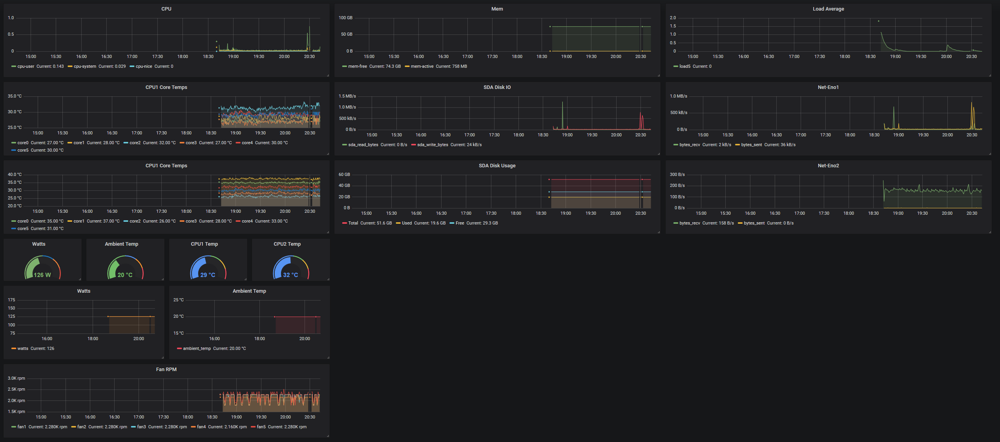

## Docker-compose files and scripts for Dell R710 monitoring
## InfluxDB
## + Grafana stack
## + Telegraf
## + telegraf.conf example
## + grafana example .json file



```
docker pull grafana/grafana
docker pull influxdb
docker pull telegraf

Read docker-compose.yml carefully
Edit telegraf.conf
```

### Build services manually and watch for errors:
```
docker-compose up -d

```

### Show me the logs:
```
docker-compose logs
```

### Stop and delete containers:
```
docker-compose stop
docker-compose rm
```

### Update images and scripts:
```
git pull
docker pull grafana/grafana
docker pull influxdb
docker pull telegraf
```

## Import example Grafana grafana-example.json file

# Further Information

[Docker Compose Installation](https://docs.docker.com/compose/install/)

[Telegraf FAQ](http://github.com/influxdata/telegraf/blob/master/docs/FAQ.md)
